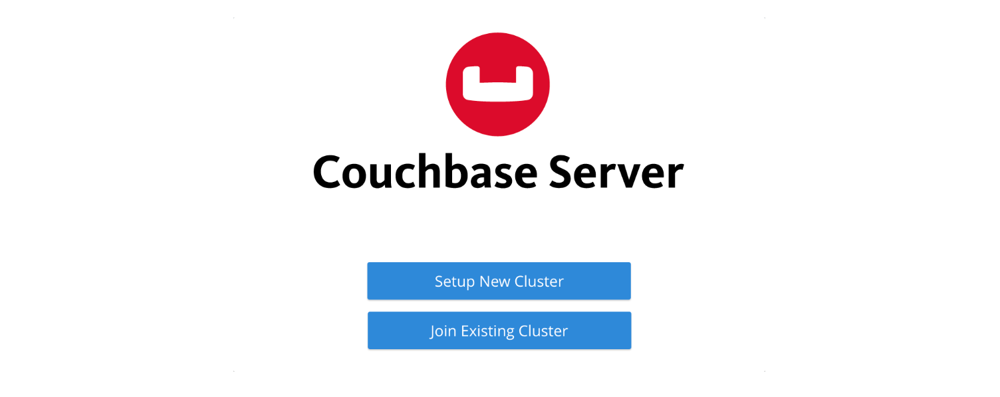
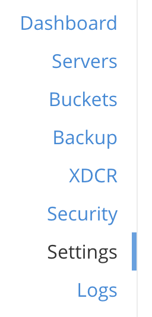
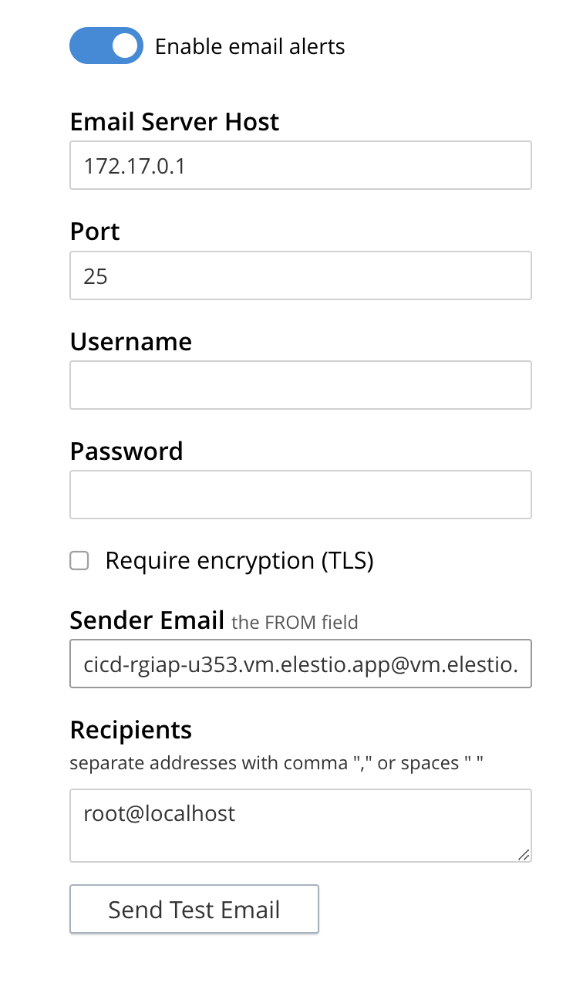
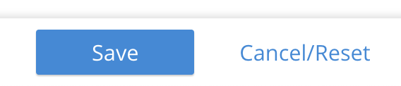

# Couchbase CI/CD pipeline

Deploy Couchbase server with CI/CD on Elestio

 
 

# Once deployed ...

You can can open Couchebase UI here:

    URL: https://[CI_CD_DOMAIN]
    Login: root
    password: [ADMIN_PASSWORD]

# Configuring SMTP Server

To configure the SMTP server, click on Settings in the left menu, then on the Alert tab.

Enable the Enable email alerts option, then enter the following credentials:

        Email Server Host:[EMAIL_HOST]
        Port: [EMAIL_PORT]
        Username and Password must be empty
        Require encryption (TLS) must not be checked
        Sender Email: [DEFAULT_FROM_EMAIL]

In the Recipients field, you can put your email address to do a test by clicking on Send Test Email.

When done, click Save.

#

# Connecting

To connect from node.js you'll need the package couchbase <a href="https://www.npmjs.com/package/couchbase">here</a> then you can connect like this:

    const couchbase = require("couchbase");
    const connectingFunction = async () => {

        try {
            var cluster = await couchbase.connect(
            "couchbase://[DOMAIN]",
            {
                username: "root",
                password: [ADMIN_PASSWORD],
            });

            const bucket = cluster.bucket("test");
            const user = {
                type: "user",
                name: "Michael",
                email: "michael123@test.com",
                interests: ["Swimming", "Rowing"],
            };

            const defaultCollection = bucket.defaultCollection();

            // Create and store a document
            await defaultCollection.upsert("michael123", user);

            // Load the Document and print it

            // Prints Content and Metadata of the stored Document
            let getResult = await defaultCollection.get("michael123");
            console.log("Get Result: ", getResult);
        } catch (error) {
        console.log(error);
        }
    };
    connectingFunction();

More informations <a href="https://docs.couchbase.com/home/index.html">here</a>
